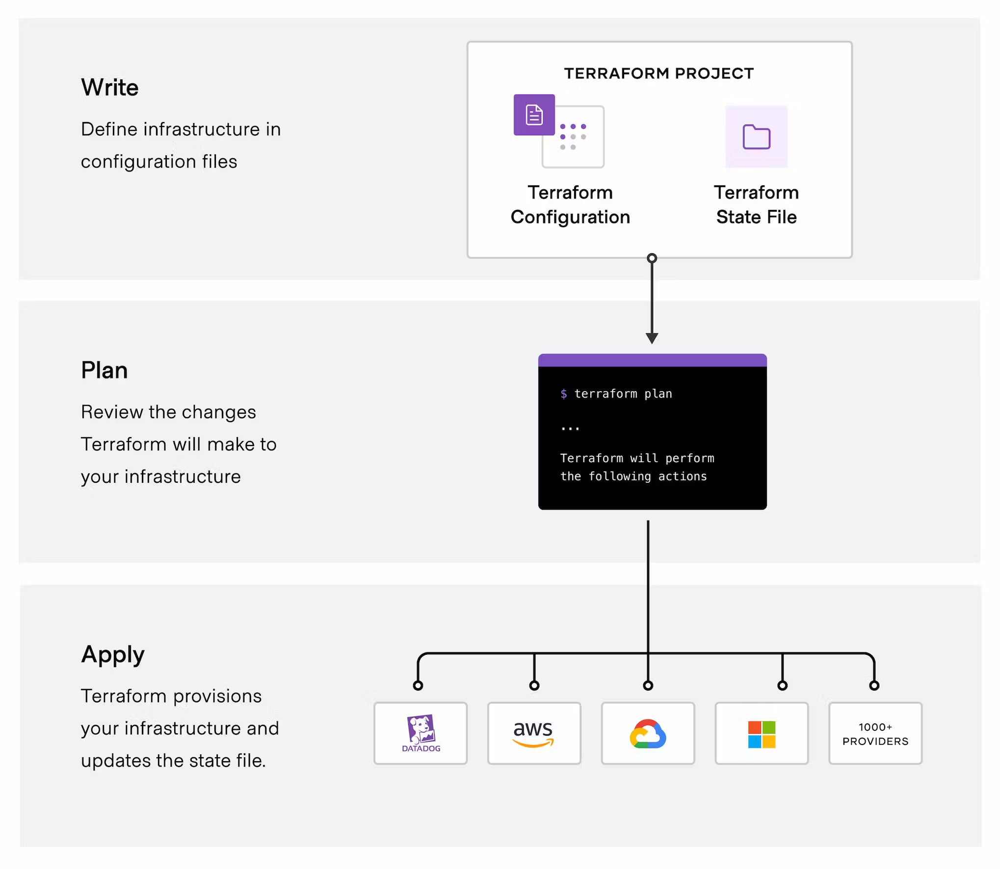

# Getting started with Terraform

Terraform is a tool that provides the ability to manage infrastructure through scripts while being the single source of truth. In other words, is an infrastructure as code tool that lets you define both cloud and on-prem resources in human-readable configuration files that you can version, reuse, and share.

## How does it work?

### Terminologies

Before understanding the working of Terraform, Let’s understand some terminologies

1. Resources – In Terraform, resources means services and sub services provided by cloud providers. EC2 is a service where security groups, snapshot, EBS are sub services utilized by the former.
2. APIs – Through API, terraform can connect to particular cloud provider to create and manage resources.
3. Provider – Bundle of APIs for a particular cloud provider such as AWS, Azure, GCP, Digital Ocean and so on.

### Working

- Terraform creates and manages resources on cloud platforms and other services through their APIs.
- It relies on plugins called providers to interact with cloud providers, SaaS providers, and other APIs.
  

### Basic Operations

- **Write:** Defining resources in terraform files.
- **Plan:** Terraform creates an execution plan describing the infrastructure it will create, update, or destroy based on the existing infrastructure and your configuration.
- **Apply:** on approval, terraform will perform the desired action.
- **Destroy:** As the word says, it destroy the resources.
  

### Benefits

- Platform independent
- Supports multiple cloud providers.
- Write once, use forever.
- Single source of truth.
- Efficient and quick.
- Terraform cloud that supports state management.

### prerequisite/Dev Environment Setup

- AWS account
- Access and Secret key of the account you want to use.
- [AWS CLI](https://awscli.amazonaws.com/AWSCLIV2.msi)
- configure the aws cli with access and secret key `aws configure` on terminal editor.
- [terraform binary](https://www.terraform.io/downloads)
- add terraform path into environment variable to have global access.
- terraform will use your aws credential to talk to AWS.

### Create your first resource

- Clone this repository

```
https://github.com/navsin189/getting-started-with-terraform.git terraform
cd terraform
```

- Initialize terraform directory

```
terraform init
```

- check the format of scripts

```
terraform fmt
```

- Plan your infra

```
terraform plan
```

- Apply the changes

```
terraform apply
```
